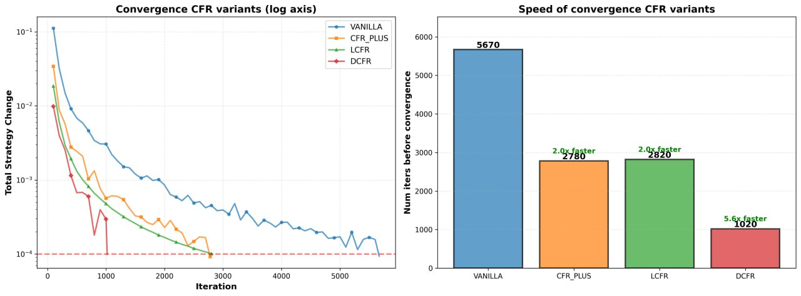
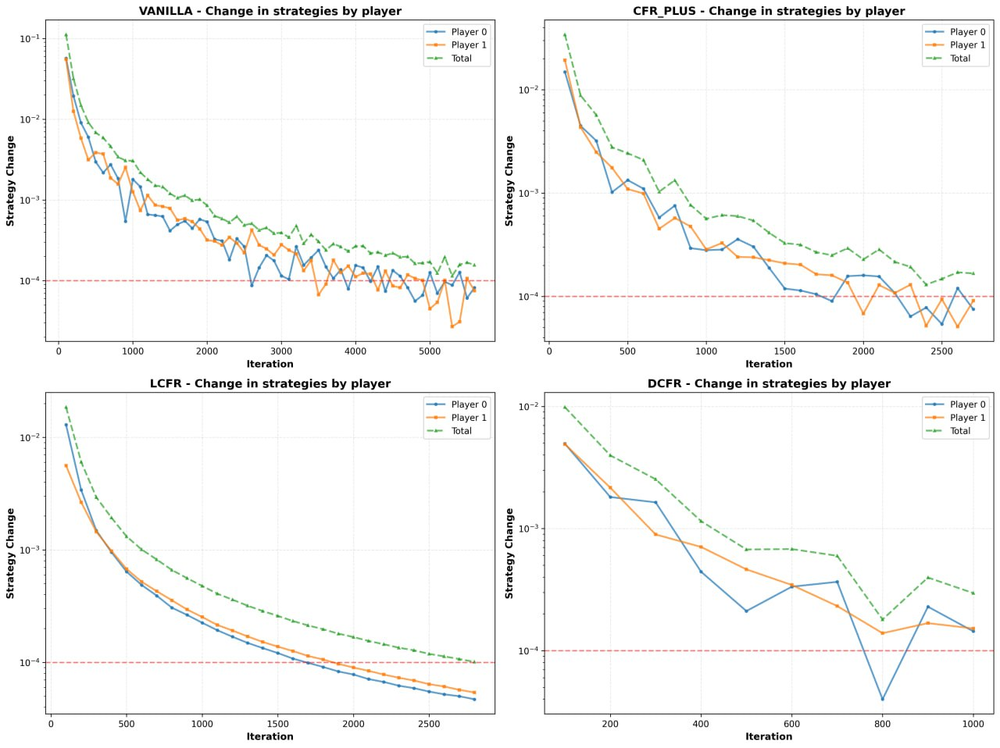

**Solving Imperfect-Information Games via Discounted Regret Minimization**
*paper by Noam Brown and Tuomas Sandholm*

**Review**

Games with incomplete information can be used for many purposes, such as modeling negotiations, auctions, betting games, and so on. As always in situations where we do not have complete information and probabilities come into play, there is poker.
As we learned in the Game Theory course, the ultimate goal (solution) of a situation (game) is to maximize the player's winnings (search for equilibrium).

Since solving such games and drawing decision trees by hand would be very difficult, tedious, and wasteful of paper, computer algorithms are used for such simulations, the most popular of which are Counterfactual Regret Minimization (CFR) and CFR+, which works better.

Theory:
Sequential games, description of standard components
- set of players - *P*
- nature as a player - *N* - chooses actions with a fixed and known probability distribution
- state *h* - all information about the state of the game at a specific moment, all information known to the players is present here
- set of actions *A(h)* - actions available to players in state *h* 
- player *P(h)* - a player who moves in state *h*

If action $a \in A(h)$ leads from *h* to *h'*, then *h * a = h'*.
- *H* - the set of all states in the game tree
- $Z \subseteq H$ - leaves of the tree, for which there are no further actions
- For each player $i \in P$ there is a reward function $u_i : Z \to R$
- Reward limits $\Delta$, such that $\Delta_i = max_{z \in Z}u_i(z) - min_{z \in Z} u_i(z)$ and $\Delta = max_{i \in P} \Delta_i$

Imperfect information in these games is described using information sets for each player
- Infoset *I* for player *i* all states *h, h'* $\in$ *I* are indistinguishable for player *i*
- Each non-terminal state $h \in H$ belongs to only one infoset for each player.
- *A(I)* - a set of actions that a player can choose from infoset *I*
- $I_i$ - all infosets of player *i*

Strategies
- Strategy $\sigma_i(I)$ is a vector of probabilities for all actions for player *i* in infset *I*. Since all states of the infset are indistinguishable by the player, all strategies in each state are identical.
- Probability of a specific action - $\sigma_i(I, a)$
- $h \in I$, $\sigma_i(h, a) = \sigma_i(I, a)$ where *i = P(h)*
- $\sigma_i$ - strategy for player *i* in each infonet of the game where player *i* plays
- Profile of strategies $\sigma$ - tuple of strategies, one per player.
- $\sigma_{-i}$ - strategies of all players except player *i*
- $u(\sigma_i, \sigma_{-i})$ - expected winnings of player *i* if all other players play according to the strategy profile $<\sigma_i, \sigma_{-i}>$

Probabilities
- $\pi^{\sigma}(h) = \prod_{(h,a) \subseteq h} \sigma_{P(h)}(h,a)$ - joint probability of reaching state *h* if all players play according to $\sigma$

Best answer
- $\text{BR}(\sigma_i) \in \arg\max_{\sigma_{-i}} u_i(\sigma_i, \sigma_{-i})$ -
- $u_i(\sigma_i, \text{BR}(\sigma_i))= \max_{\sigma_{-i}} u_i(\sigma_i, \sigma_{-i})$ - the best response to $\sigma_i$
- For all players i: u_i(σ_i*, σ_-i*) = max_{σ_i} u_i(σ_i, σ_-i*) - Nash equilibrium
- e(σ_i) = u_i(σ_i*, BR(σ_i*)) - u_i(σ_i, BR(σ_i)) - exploitability of a strategy relative to the best response to the Nash equilibrium strategy

In CFR, the strategy vector for each infoset is determined using the Regret-Minimization algorithm. The Regret-Matching (RM) algorithm is used in CFR because of its simplicity and clarity. 

The expected value of player *i* in state *h* If all players play according to the strategy profile $\sigma$ from this point is defined as $v_i^{\sigma}(h)$.

$v^\sigma(I)=\sum_{h \in I}\pi_{-i}^\sigma(h \mid I)\, v_i^\sigma(h)$ and $v^\sigma(I,a)=\sum_{h \in I}\pi_{-i}^\sigma(h \mid I)\, v_i^\sigma(h \cdot a)$ is the expected value for player *i* in infset *I* where *i* acts is the weighted average of all states in *I* where the weight is proportional to player *i* that he is in a certain state when he knows that he is in *I*, where $\pi_{-i}^\sigma(h \mid I)=\frac{\pi_{-i}^\sigma(h)} {\pi_{-i}^\sigma(I)}.$

Let $\sigma^t$ be the strategy at iteration t. Instantaneous regret for action *a* in *I* at *t*:
$r^t(I,a)=v^{\sigma^t}(I,a)-v^{\sigma^t}(I).$

Total regret:
$R^T(I,a)=\sum_{t=1}^{T} r^t(I,a). \tag{1}$

Regret on positive real numbers:
$R_+^T(I,a) = \max\{R^T(I,a), 0\}$

Regret of the infoset:
$R^T(I) = \max_{a} R_+^T(I,a).$

Regret of player *i* during the entire game:
$R_i^T=\max_{\sigma_i}\sum_{t=1}^{T}\bigl[u_i(\sigma_i, \sigma_{-i}^t)-u_i(\sigma_i^t, \sigma_{-i}^t)\bigr].\tag{2}$

In **Regret Matching (RM)**, the player chooses the distribution of actions in the information set in proportion to the positive regret for these actions. For example, at iteration \(t+1\):  
σ^{T+1}(I,a) = 
  - R_+^T(I,a) / sum_{a' in A(I)} R_+^T(I,a'), if sum_{a' in A(I)} R_+^T(I,a') > 0
  - 1 / |A(I)|, otherwise

If the player plays RM in each iteration, then

$R^T(I)\le\Delta\, |A(I)| \sqrt{T}\quad$

If the player plays CFR in each iteration, then
$R_i^T\le\sum_{I \in \mathcal{I}_i} R^T(I)\tag{4}$, and therefore, when $t \to \inf$ $\frac{R_i^T}{T} \to 0.$

The **average strategy** of player *i* for infoset *I* is:

σ̄_i^T(I) = (sum_{t=1}^{T} π_i^{σ^t}(I) * σ_i^t(I)) / (sum_{t=1}^{T} π_i^{σ^t}(I))

CFR minimizes external regret, therefore it coincides with coarse correlated equilibrium. In zero-sum games with two players, it is also a Nash equilibrium. If the average regret of both players satisfies $\frac{R_i^T}{T} \le \varepsilon,$ then their average strategies form a 2$\epsilon$-Nash equilibrium.

**This is why CFR is an algorithm for finding $\epsilon$-Nash equilibrium for two-player zero-sum games.**

Although CFR updates players' regrets at each iteration, in practice it works better to update regrets in turn order. However, this complicates the convergence of the theory.

CFR+ is CFR with minor changes, such as:
- at each iteration where regret < 0, it is assigned 0
- **CFR+** chooses a strategy on move \(t+1\) according to the *RM+* approach, which is identical to:

σ^{T+1}(I,a) = 
  - R_+^T(I,a) / sum_{a' in A(I)} R_+^T(I,a'), if sum_{a' in A(I)} R_+^T(I,a') > 0
  - 1 / |A(I)|, otherwise

However, it uses a regret-like value $Q^T(I,a) = \max\{0, Q^{T-1}(I,a) + r^T(I,a)\}$.
This algorithm also uses a weighted average strategy where iteration *t* is weighted by *t* rather than by uniformly distributed strategy weights as in CFR.

# Types of CFR Improvements

| Algorithm             | Positive regrets       | Negative regrets       | Avg. strategy weight | Regret floor | Notes                       |
|----------------------|---------------------|---------------------|-------------------|-------------|----------------------------|
| CFR                  | 1                   | 1                   | 1                 | No          | Vanilla CFR                |
| CFR⁺                 | 1                   | 0                   | ∝ t²               | Yes         | Faster empirical convergence |
| LCFR                 | ∝ t                 | ∝ t                 | ∝ t               | No          | Linear discounting         |
| DCFR                 | α=3/2               | β=0                 | γ=2               | Yes         | Best empirical performance |

**Report**

We decided to focus on the implementation and simulation of a Kuhn poker game.
To do this, we implemented all of the above types of CFR, as well as the game itself, and conducted simulations with early stopping. The results are shown below. 

Our implementation consists of several parts: CFR variants, game, additional classes (information set, game state, action).

All these classes describe their part of the game:
- Action - a class that describes an action in the game
- Info set - a class for describing and creating a set of information known to players
- Game state - an abstract class for describing the state of the game at a specific point in time
- Cfr - implementation of the 4 types of CFR described above in the table

All of this is used to simulate the game of Kuhn poker implememted in main.py.

First, we implemented a simple training of 10,000 iterations to check if our algorithm works. Then we came up with an idea for optimization - to check if the equilibrium state of the game has not changed for several moves, so we added early stopping to reduce the amount of time spent on training. 
Overall, it didn't take much time, but it reduced the training time by three times.

We can see from the graphs that thanks to early stopping, DCFR started to stop at 2000 iterations, which significantly reduced the training time. 

**Results**

From these results, we can see that the DCFR algorithm converges the fastest, while VANILLA, or simple CFR, converges the slowest. 
We can also see that all types of CFR except Linear converge with significant jumps, while LCFR converges along a certain branch of the hyperbola. 
The graphs showing changes in player strategy indicate that strategy changed most often with CFR, least often with DCFR, and most calmly with LCFR. 

Therefore, we can conclude that games with incomplete information, especially complex ones such as poker, are played for a long time until equilibrium is reached. 

